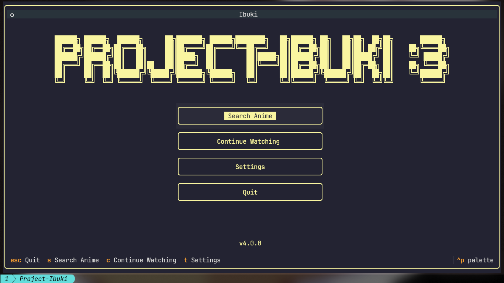
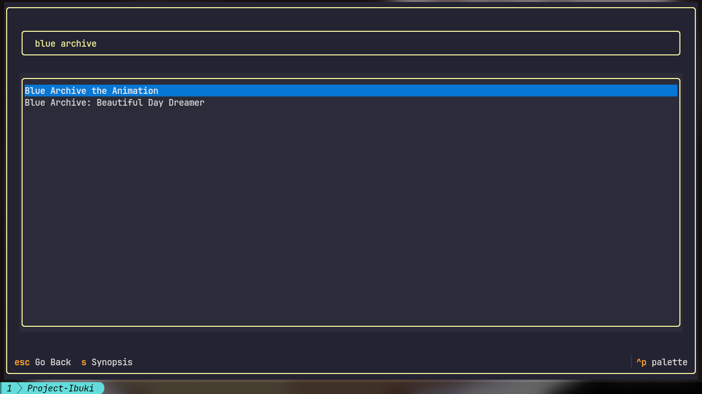
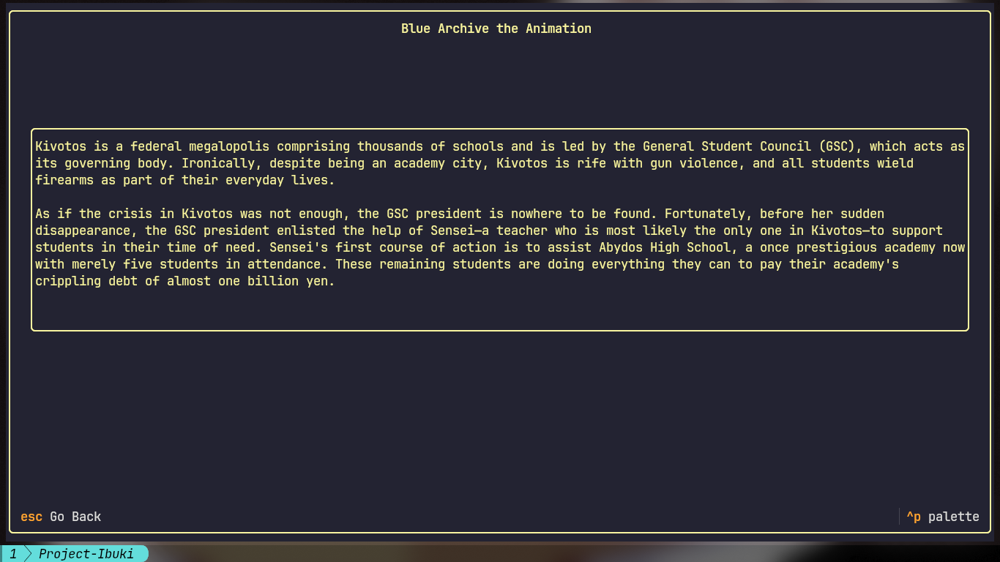
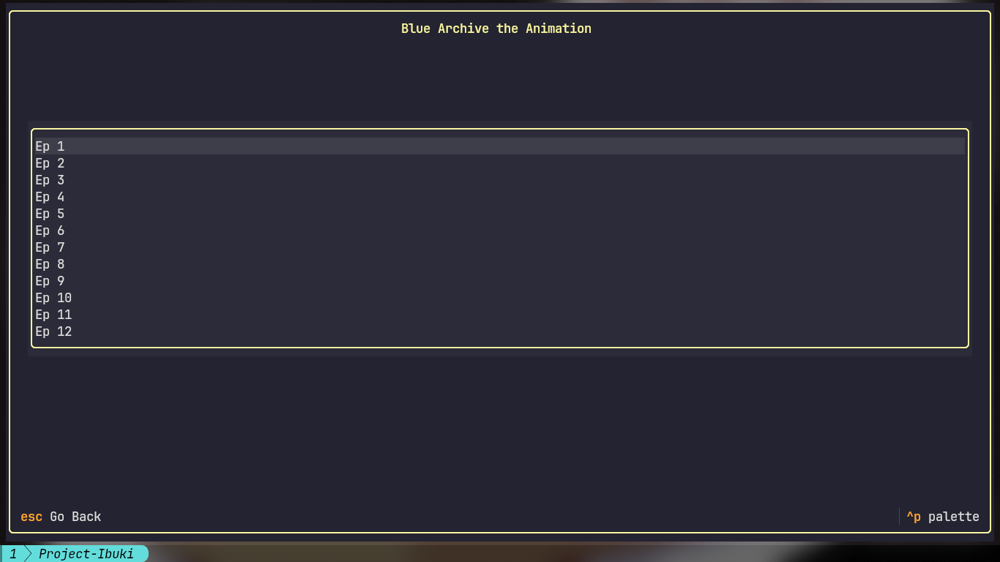

<div align="center">
    
    <br>
    
    
</div>
<br>

**Modern Terminal UI for anime streaming**\
A sleek, interactive TUI application for browsing and watching anime, powered by a custom backend built on `anipy-api` and Textual.

---

## Features

* **Rich Terminal Interface** – Interactive TUI with mouse support
* **Reliable Backend** – Fast-ish synchronous anime fetching using `anipy-api`
* **Modern UX** – Browse anime with panels, tabs, and real-time updates
* **Episode Management** – Queue episodes, track progress*, seamless playback
* **Fast Releases** – Quickly access the latest anime releases

---

---

## Installation


<details>
<summary> Linux & macOS (Bash)</summary>

Run this to install or upgrade Ibuki instantly:

```bash
curl -sSL https://raw.githubusercontent.com/XeonXE534/Project-Ibuki/main/install.sh | bash

```

>*For a hard reset, run this instead:*

```bash
curl -sSL https://raw.githubusercontent.com/XeonXE534/Project-Ibuki/main/install.sh | bash -s -- --hard-reset

```

</details>

<details>
<summary> Windows (PowerShell)</summary>

Open PowerShell as User and run this:

```powershell
Set-ExecutionPolicy Bypass -Scope Process -Force; iex ((New-Object System.Net.WebClient).DownloadString('https://raw.githubusercontent.com/XeonXE534/Project-Ibuki/main/install.ps1'))

```

>*For a hard reset, run this instead:*

```powershell
Set-ExecutionPolicy Bypass -Scope Process -Force; $script = (New-Object System.Net.WebClient).DownloadString('https://raw.githubusercontent.com/XeonXE534/Project-Ibuki/main/install.ps1'); Invoke-Expression "& { $script } --hard-reset"

```

</details>

---

### Post-Installation

Once the script finishes its business, you can launch the project from anywhere by simply typing: `ibuki`

---

## Requirements

* **Python 3.10+**
* **Terminal** with True Color support (Kitty is recommended)
* **PiP packages** (installed via `install.sh`)
* **MPV**

---

## Screenshots






---

## Roadmap

* [x] ~~CLI-based anime streaming~~ → **TUI Implementation**
* [x] Enhanced episode browsing and search
* [x] Watch history
* [x] User preferences
* [ ] Cross-platform distribution

---

## Notes

- Only Linux is fully supported as of 3.x.x releases.
- MPV must be installed and available in your PATH for playback.
---

## Contributing

Contributions welcome!
Fork, tweak, and submit PRs. Any improvements are welcome.

---

## License

GPL 3.0 – see LICENSE file for details

---

## Credits
- Backend: [Anipy](https://github.com/sdaqo/anipy-cli)
- UI: [Textual](https://github.com/textualize/textual/)

*Built with ❤️ for the anime community*

---

## Disclaimer

Project-Ibuki is an independent, open-source project and is not affiliated with, endorsed, or sponsored by Nexon Games, Yostar, or Blue Archive.
The character Ibuki and related assets belong to Nexon Games Co., Ltd.
All character references are for fan and educational purposes only.

If you are a copyright holder and believe any content used here violates your rights, please open an issue or contact me — I'll remove it immediately.