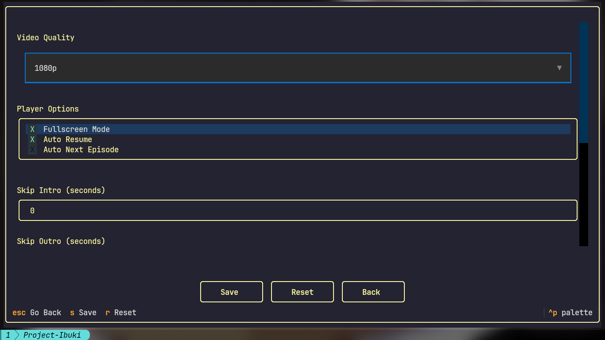

<div align="center">
    
    <br>
    
    
</div>
<br>

**Modern Terminal UI for anime streaming**\
A sleek, interactive TUI application for browsing and watching anime, powered by a custom backend built on `anipy-api` and Textual.

---

## Features

* **Rich Terminal Interface** – Interactive TUI with mouse support
* **Reliable Backend** – Fast-ish synchronous anime fetching using `anipy-api`
* **Modern UX** – Browse anime with panels, tabs, and real-time updates
* **Episode Management** – Queue episodes, track progress, seamless playback
* **Fast Releases** – Quickly access the latest anime releases

---

## Installation

### Linux

```
git clone https://github.com/PandemoniumLabs/Rikka.git
cd Rikka
    
bash ./install.sh
```
After installation, you can run Rikka anywhere using: `rikka`

### Windows (Experimental)
The TUI experience on Windows varies by terminal. For best results, use **Windows Terminal**.

1. Install Python 3.10+ and MPV (ensure they are in your PATH).
2. `git clone https://github.com/PandemoniumLabs/Rikka.git`
3. `cd Rikka`
4. `pip install -e .`
5. `python -m src.rikka.__main__`

*Note: Windows support is spotty.*

---

## Requirements

* **Python 3.10+**
* **Terminal with True Color support**
* **PiP packages** (installed via `install.sh`)
* **MPV**

---

## Screenshots




---

## Roadmap

* [x] ~~CLI-based anime streaming~~ → **TUI Implementation**
* [x] Enhanced episode browsing and search
* [x] Watch history
* [x] User preferences
* [x] Cross-platform distribution

---

## Notes

- Linux & Windows supported as of 5.0.0. (Windows support is spotty).
- MPV must be installed and available in your PATH for playback.
- There will not be further major releases to the TUI after 5.0.0. Only critical bug fixes, compatibility fixes, and GUI updates, no new features.
- GUI version is in development

---

## Contributing

Contributions welcome!
Fork, tweak, and submit PRs. Any improvements are welcome.

---

## License

GPL 3.0 – see LICENSE file for details

---

## Credits
- Backend: [Anipy](https://github.com/sdaqo/anipy-cli)
- UI: [Textual](https://github.com/textualize/textual/)

*Built with ❤️ for the anime community*